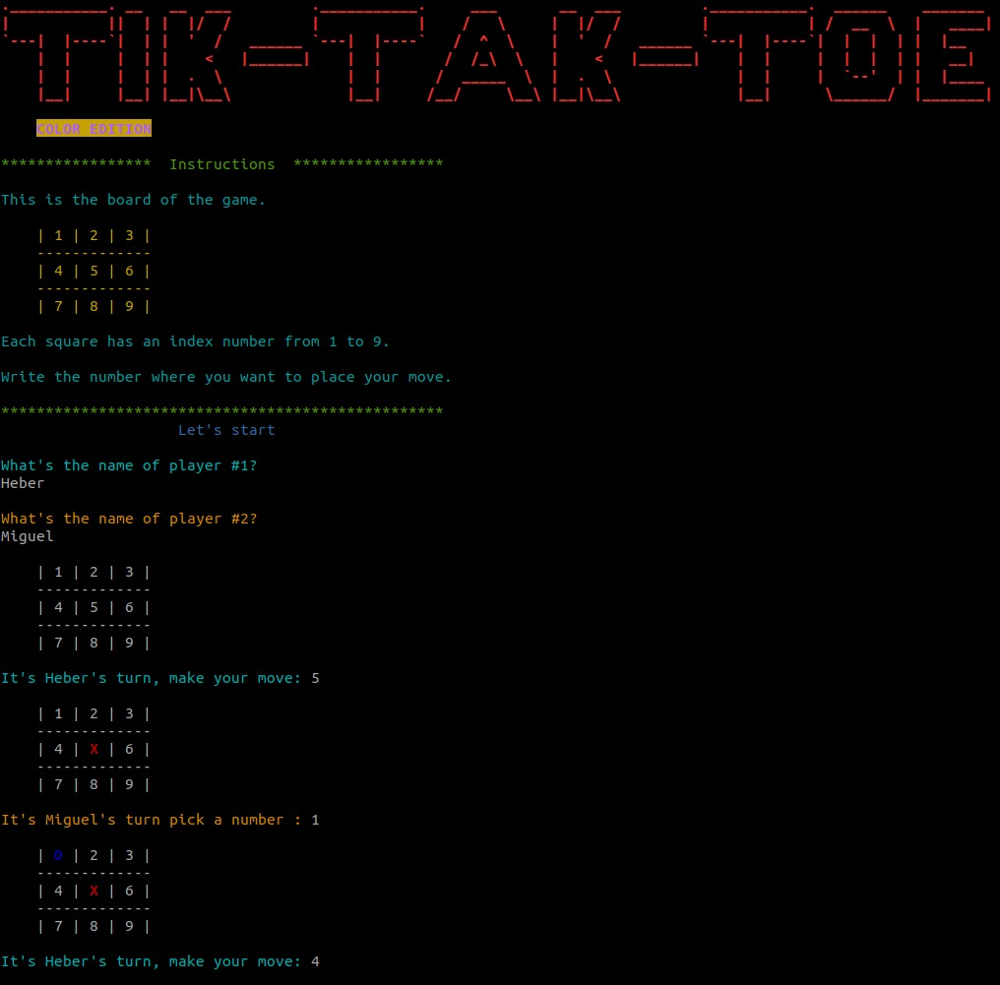
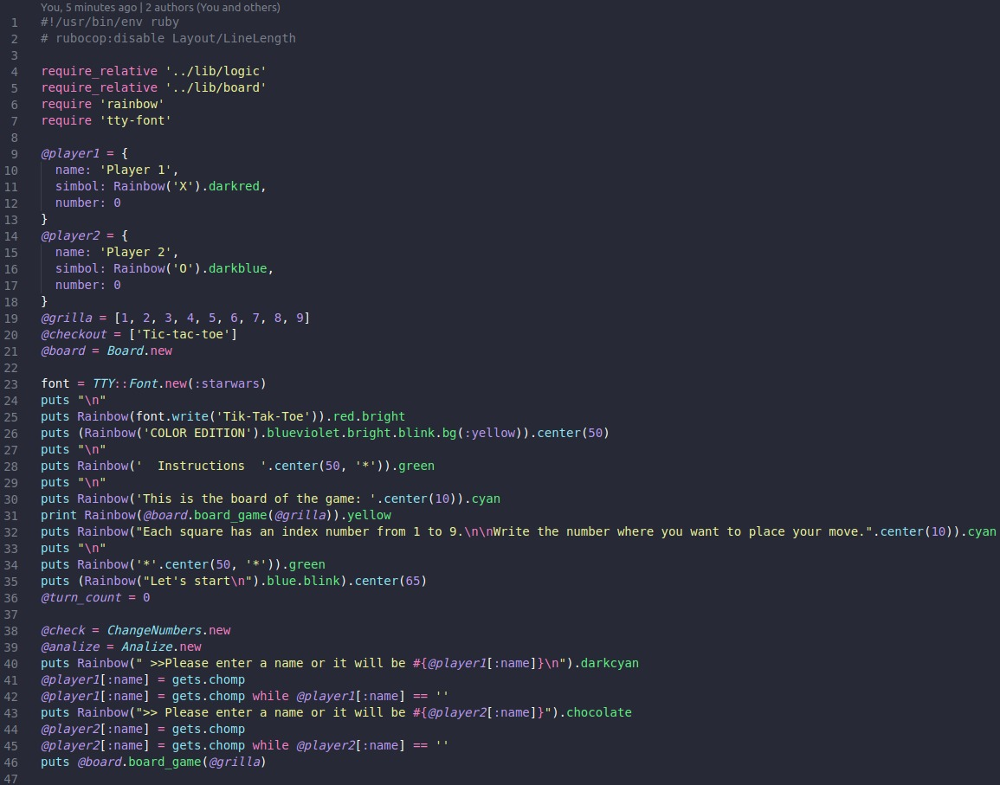

# Tic-Tac-Toe
In this project, we created our own version of the popular game Tic-Tac-toe.

Common definition of Tic-Tac-Toe

> "Paper-and-pencil game for two players, X and O, who take turns marking the spaces in a 3×3 grid. The player who succeeds in placing three of their marks in a horizontal, vertical, or diagonal row is the winner."



The main goal is to put into practice the main concepts of Object-Oriented Programming. Particularly, classes and access to their attributes.

## Built With

- Ruby v 2.7
- Rainbow gem
- TTY font gem

### Setup

To run this project locally, please ensure you have Ruby installed on your machine, then clone this repository by running.

```bash
git clone https://github.com/Wusinho/Tic-Tac-Toe
```

After cloning open the file and write in terminal:

```bash 
 ruby main.rb
```
<b>Maximize your terminal window for a better experience</b>

The code:



### Game's instructions
<ul>
 <li>Tic-Tac-Toe is a two players game.</li>
 <li>Follow the instructions on the screen to input the names of the players</li>
 <li>Each player has to select a number on the board between 1 to 9</li>
 <li>If you select a number outside the range or a position is already taken, you will need to select again.</li>
 <li>If there's a winner or there aren't any possible movements, the match ends.</li>
</ul>

### Authors

👤 <b>Heber Lazo</b>

- Github: [@Wusinho](https://github.com/Wusinho)
- LinkedIn: [in/web-developer](https://www.linkedin.com/in/heber-lazo-benza-523266133/)


👤 <b>Miguel Ricaño</b>

- Github: [@mricanho](https://github.com/mricanho)
- Linkedin: [Miguel Ricaño](https://www.linkedin.com/in/mricanho/)


## Show your support

Give a ⭐️ if you like this project!

## Acknowledgments

- Microverse
- The Odin Project

## 📝 License

This project is [MIT](LICENSE.md) licensed.
